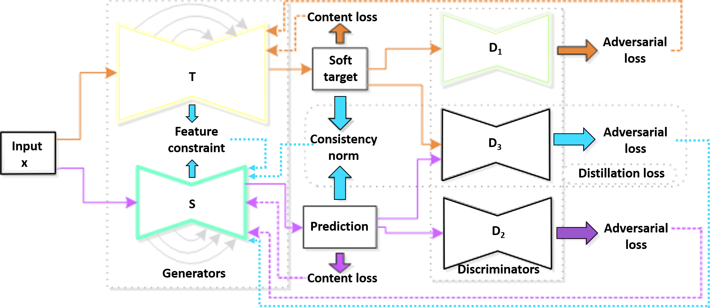
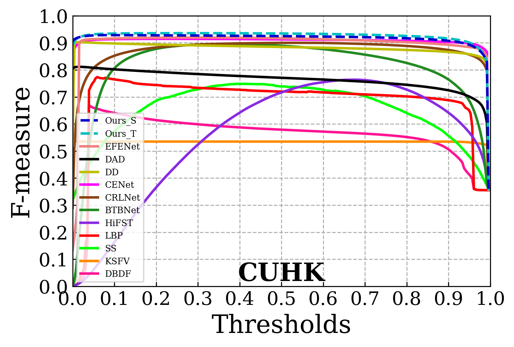
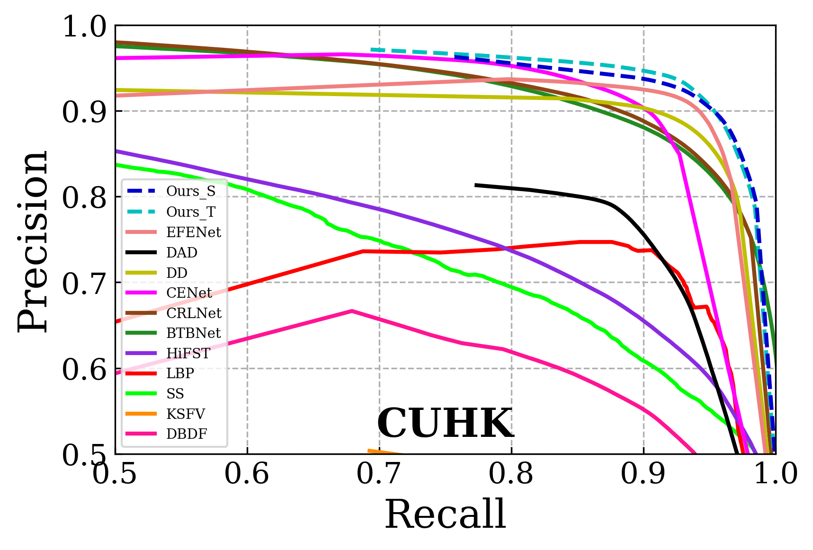
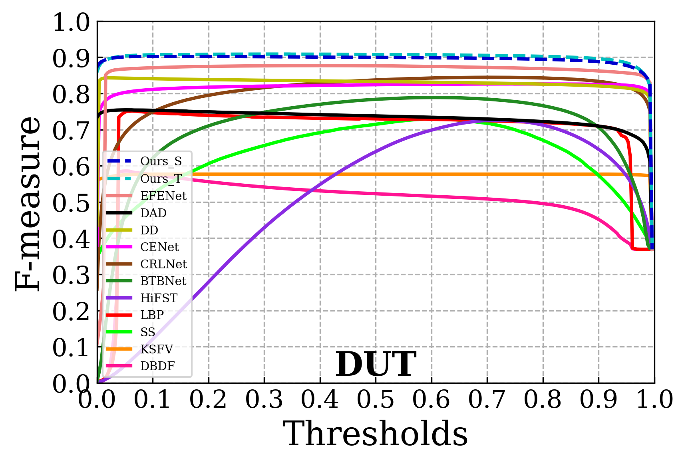
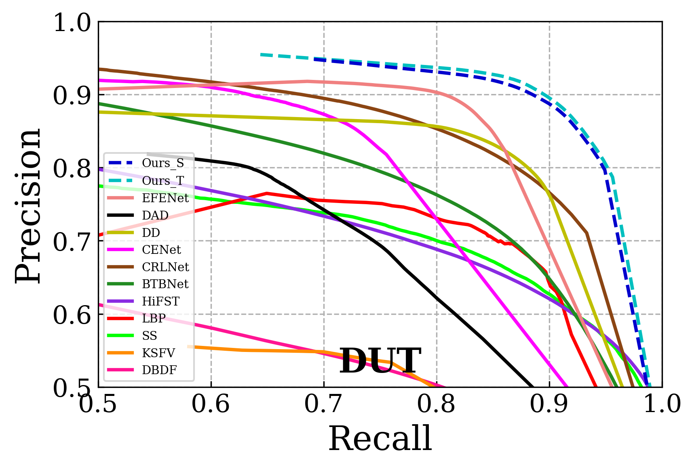
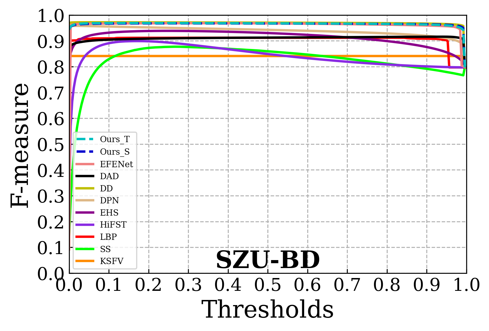
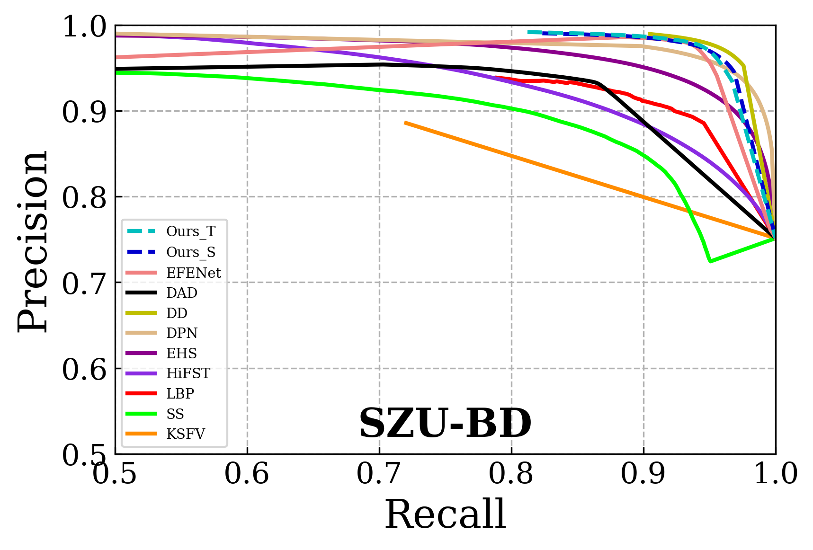

# [ACM TOMM (2022)] Distill-DBDGAN: Knowledge Distillation and Adversarial Learning Framework for Defocus Blur Detection

<p align="center">

</p>

This repository represents the official implementation of the paper titled "Distill-DBDGAN: Knowledge Distillation and Adversarial Learning Framework for Defocus Blur Detection".

[](https://dl.acm.org/doi/pdf/10.1145/3557897)
[](https://opensource.org/licenses/MIT)

[Sankaraganesh Jonna](https://www.linkedin.com/in/ganeshjonna/),
Moushumi Medhi,
[Rajiv Ranjan Sahay](https://www.iitkgp.ac.in/department/EE/faculty/ee-rajiv)

We present Distill-DBDGAN, a defocus blur detection model, that segment the blurred regions from a given image affected by defocus
blur in resource-constraint devices. Its core principle is to leverage knowledge distillation by transferring information from the larger teacher network to a compact student network for mobile applicability. All the networks are adversarially trained in an end-to-end manner.

<p align="center">
  
  
  
  
  <br>
</p>

## Datasets
We have evaluated on the publicly available datasets [```CUHK```](http://shijianping.me/jnb/index.html), [```DUT```](http://ice.dlut.edu.cn/ZhaoWenda/BTBCRLNet.html), and [```SZU-Blur Detection```](https://github.com/mathxlsun/BD_EFPN/tree/master/SZU-BD) for evaluation. You can download them from the following:

```CUHK_test``` [dropbox](https://dl.dropboxusercontent.com/scl/fi/k4q30kc6pl6ahs1l10gv9/CUHK_test.zip?rlkey=7be5e6q1iiimu7kyssmn5b94d&st=lcrg2mxt&dl=0)

```DUT_test``` [dropbox](https://dl.dropboxusercontent.com/scl/fi/txz4220t46oszstpdxbp0/DUT_test.zip?rlkey=ksm55vwlxin4jnc7yymzg7d3r&st=5qhmn82o&dl=0)

```SZU-BD_test``` [dropbox](https://dl.dropboxusercontent.com/scl/fi/6klgat0bdflr0dl3okqzs/SZU-BD_test.zip?rlkey=ztfa77kzp1v1mze0iik072a8b&st=iadt0m9d&dl=0)

If you want to do the inference on your own dataset, you can change the format of your dataset according to the provided dataset. The defocus blur detection masks output by our model are labeled with non-zero values for blur. However, some datasets provide ground truth blur masks where blur is marked as zero. To ensure consistency with our model's output, we need to convert the ground truth masks from these datasets to a uniform format that aligns with our model's format.

## Testing

 To test our model, run the testing script: : ```DISTILL_DBD.sh```

 ```
bash DISTILL_DBD.sh
 ```
Our pretrained model can be downloaded from [here](https://dl.dropboxusercontent.com/scl/fi/e5rkqcq1zqgs84a0b2vpg/trained_model.zip?rlkey=49ffoyftac9naekdtx57obt43&st=c0aav0bn&dl=0)

## Results
We provide results on all the three datasets: ```CUHK```, ```DUT```, and ```SZU-Blur Detection```. The results obtained from our trained models can be directly accessed from [here](https://dl.dropboxusercontent.com/scl/fi/wbb82tc5ejkg0viyw1ywy/Results.zip?rlkey=i2bjqx32d76qg2nrclpdtuc39&st=gaoe72q7&dl=0);
<p align="center">
  
  
  <br>
</p>
<p align="center">
  
  
  <br>
</p>
<p align="center">
  
  
  <br>
</p>

## Contact

- Moushumi Medhi: medhi.moushumi@iitkgp.ac.in

## Dedication
This paper is for you, [Sankar](https://www.linkedin.com/in/ganeshjonna/) for being an enthusiastic contributor, a dedicated researcher, a genuine friend, and most importantly, an amazing human being. Your expertise was essential in developing the code. May you continue to shine wherever you are. Your influence will always be remembered and cherished.

## Citation
If you find this repo useful, please consider citing:
```
@article{10.1145/3557897,
author = {Jonna, Sankaraganesh and Medhi, Moushumi and Sahay, Rajiv Ranjan},
title = {Distill-DBDGAN: Knowledge Distillation and Adversarial Learning Framework for Defocus Blur Detection},
year = {2023},
issue_date = {April 2023},
publisher = {Association for Computing Machinery},
address = {New York, NY, USA},
volume = {19},
number = {2s},
issn = {1551-6857},
url = {https://doi.org/10.1145/3557897},
doi = {10.1145/3557897},
journal = {ACM Trans. Multimedia Comput. Commun. Appl.},
month = {feb},
articleno = {87},
numpages = {26}
}
```
## Acknowledgement

We sincerely thank the  owners of the following source code repos: [CUHK](http://shijianping.me/jnb/index.html), [DUT](http://ice.dlut.edu.cn/ZhaoWenda/BTBCRLNet.html), and [SZU-Blur Detection](https://github.com/mathxlsun/BD_EFPN/tree/master/SZU-BD) for sharing the datasets, which are used by our released code.

For the encoder structure of the student network, We utilize the pytorch code: [EfficientNetB3](https://github.com/zhoudaxia233/EfficientUnet-PyTorch/tree/master)

We also thank the anonymous reviewers of ACM TOMM for their helpful feedbacks.
